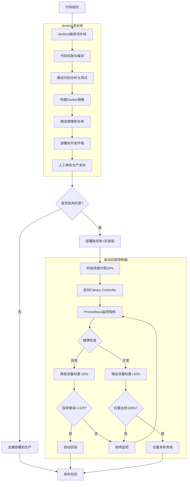

# 自动化灰度发布流程图

## 详细流程说明

### 1. 开发流程
1. 开发人员提交代码到Git仓库
2. Jenkins自动触发CI/CD流水线
3. 执行代码检查、单元测试、构建镜像
4. 自动部署到开发环境验证

### 2. 生产发布
- **全量发布**：直接部署新版本，100%流量到新版本
- **灰度发布**：
  - 同时部署稳定版和灰度版
  - 初始分配10%流量到灰度版
  - 启动自动灰度控制器

### 3. 自动灰度调整
自动灰度控制器持续运行，每隔30秒执行一次：
1. 从Prometheus查询指标（错误率、延迟、内存使用等）
2. 检查应用健康状态
3. 健康则增加灰度权重（+10%）
4. 不健康则降低灰度权重（-10%）
5. 连续3次错误自动回滚
6. 权重达到100%则完成全量发布

## 关键组件

| 组件 | 文件位置 | 作用 |
|------|---------|------|
| Jenkins流水线 | [Jenkinsfile](file:///workspace/Jenkinsfile) | 代码构建、测试、部署 |
| 灰度控制器脚本 | [scripts/canary_controller.py](file:///workspace/scripts/canary_controller.py) | 监控指标、自动调整权重 |
| Helm Chart | [charts/jvm-demo/](file:///workspace/charts/jvm-demo/) | Kubernetes资源管理 |
| Nginx Ingress | [charts/jvm-demo/templates/canary-ingress.yaml](file:///workspace/charts/jvm-demo/templates/canary-ingress.yaml) | 流量分配控制 |
